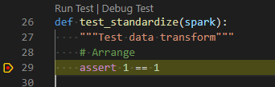

# Databricks PySpark package base
Databricks offers a notebook-style development interface. However, to take advantage of the full-suite of Python tooling, it is necessary to move code into a Python package. This is a sample python package that can serve as a starting point for PySpark development on Databricks. It makes use of [VSCode Devcontainers](https://code.visualstudio.com/docs/remote/containers) for easy setup.

## Development setup

### Pre-requisites:
- [Docker](https://www.docker.com/)
- [VSCode](https://code.visualstudio.com/)
- [Databricks CLI](https://docs.databricks.com/dev-tools/cli/index.html) -- comes installed in the devcontainer as well, but used to retrieve cluster ids
- [Databricks workspace](https://azure.microsoft.com/en-au/free/databricks/)

### Steps to setup Development environment:

1. Open solution in VSCode.
2. Create an `.env` file. Optionally, set the following environment variables.
    - If you will be uploading the package to a Databricks workspace as part of the Development cycle, you can optionally set these:
      - **DATABRICKS_HOST** - Databricks workspace url (ei. https://australiaeast.azuredatabricks.net/)
      - **DATABRICKS_TOKEN** - PAT token to databricks workspace
      - **DATABRICKS_DBFS_PACKAGE_UPLOAD_PATH**
        - Path in the DBFS where the python package whl file will be uploaded when calling `make uploaddatabricks`. (ei. 'dbfs:/mypackages')
      - **DATABRICKS_CLUSTER_ID** 
        - Cluster Id of Databricks cluster where package will be installed when calling `make installdatabricks`. (ei. '1234-123456-abc123')
        - To retrieve cluster ids, use `databricks clusters list`.
3. In VSCode command pallete (`ctrl+shift+p`), select `Remote-Containers: Reopen in container`. First time building the Devcontainer may take a while.
4. Run `make` to see options.

    

### Sample rough inner dev cycle


1. Localy, write Data Transformation code (`mysparkpackage/core/`) and Unit Tests (`mysparkpackage/tests/`) against test data (`/data`).
2. Test and validate locally. ei. `make test`, `make lint`, `make install`
3. Upload to databricks and install on a cluster: `make installdatabricks`.
    - Note: that targeted cluster needs to be in a **running** state.
4. Test in notebook.
5. Rinse and repeat.


### Sample usage in notebook

```python
from mysparkpackage.core.transformer import transform

df = spark.read.csv("dbfs:/real-data/")
transformed_df = transform(df)

```

### Debugging unit tests locally

The Devcontainer should have ms-python extension installed and .vscode all the necessary settings. All you need to do is run `Python: Discover tests`, from the vscode command pallete. Now, all tests (currently located under the `mysparkpackage/tests` folder) should have `Run test | Debug test` annotation:

  


